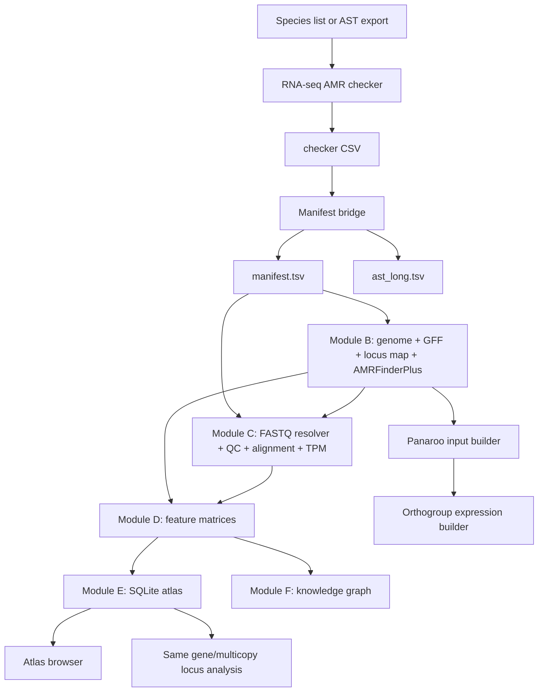

# Architecture

## Why the manifest bridge exists

The checker is discovery. It finds candidate isolates across BV-BRC, NCBI AST Browser and EBI AMR Portal, then validates RNA-seq availability through BioSample-linked SRA/ENA records.

The modules are execution. They need a strict file contract:

- `manifest.tsv`
- `ast_long.tsv`

This separation prevents accidental reruns on noisy discovery tables.

## Download fallback strategy

RNA-seq FASTQ resolution is attempted in this order:

1. Local FASTQ already present in the run folder
2. ENA URLs already present in the manifest
3. ENA lookup by run accession
4. SRA Toolkit using `prefetch` and `fasterq-dump`

Genome assembly resolution is handled through NCBI Assembly FTP paths with GenBank/RefSeq preference.
MD5 checks are used when available.
